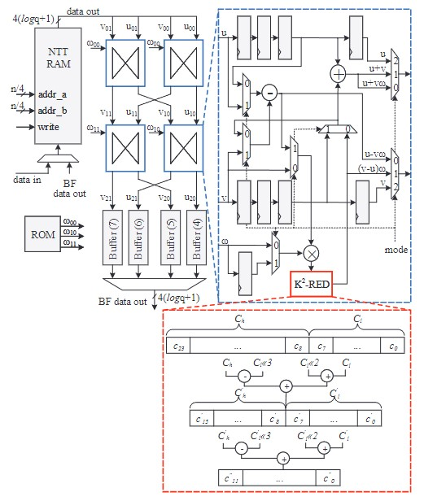
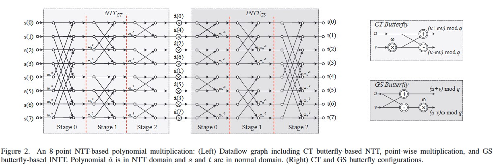
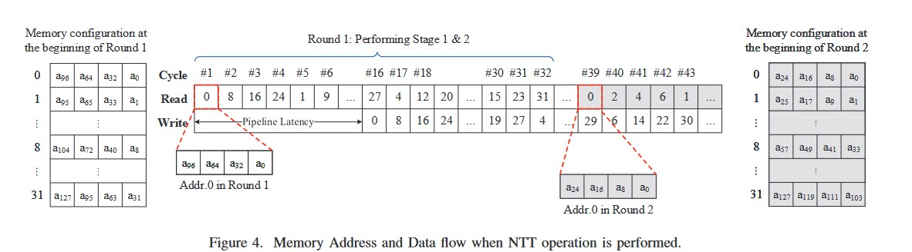

# NTT-Accelerator
An NTT Accelerator implementation based on ongoing research.

# 1. Introduction
This project aims to implement an efficient hardware accelerator for polynomial multiplication using the Number Theoretic Transform (NTT) on FPGA. The NTT is crucial in cryptographic applications like Kyber, a finalist in the NIST post-quantum cryptography standardization process, due to its potential resistance against quantum attacks. However, executing NTT efficiently poses challenges such as high memory requirements and complex memory access patterns. This research proposes an optimized NTT architecture tailored for FPGA implementation to enhance computation speed. The project focuses on developing and integrating several strategies for efficiency improvement, addressing diverse performance requirements across various applications. By leveraging FPGA’s parallel processing capabilities and customizable hardware design, the goal is to achieve significant acceleration in polynomial multiplication operations compared to traditional software-based approaches. This project is based on recent literature which propose optimized and effective hardware implementations of the NTT algorithm on FPGA yielding highly desirable results.

# 2. Objectives
Implement and test a hardware accelerator to effectively perform the Number Theoretic Transform on FPGA. We
will focus on optimizing the implementation further by incooperating recent research.

# 3. Methodology
The implementation will be based on the paper [BAM24] which describes the implementation of an optimized NTT
algorithm on an FPGA. Testing will be done using the implementation on FPGA and the results will be analyzed.

# 3.1 NTT Algorithm
The Number Theoretic Transform (NTT) is a generalization of the Discrete Fourier Transform (DFT) over finite fields. The NTT is used in polynomial multiplication and is crucial in cryptographic applications like Kyber, a finalist in the NIST post-quantum cryptography standardization process, due to its potential resistance against quantum attacks. The NTT algorithm is defined as follows: 

Terms:
- $p$ is a prime number.
- $n$ is a power of 2.
- $\omega$ is a primitive $n$-th root of unity modulo $p$.
- $a = (a_0, a_1, \ldots, a_{n-1})$ is a sequence of $n$ elements. When $a$ is a polynomial, $a_i$ is the coefficient of $x^i$.
- $A = (A_0, A_1, \ldots, A_{n-1})$ is the NTT of $a$.

Forward NTT:
$$A_k = \sum_{j=0}^{n-1} a_j \cdot \omega^{jk} \mod p$$

Inverse NTT:
$$a_k = \frac{1}{n} \sum_{j=0}^{n-1} A_j \cdot \omega^{-jk} \mod p$$

# 3.2 Pointwise Multiplication
Pointwise multiplication is a fundamental operation in many applications, including error correction, signal processing, and cryptography. Given two sequences $a = (a_0, a_1, \ldots, a_{n-1})$ and $b = (b_0, b_1, \ldots, b_{n-1})$, the pointwise product $c = (c_0, c_1, \ldots, c_{n-1})$ is defined as follows:

$$c_k = a_k \cdot b_k \mod p$$

To efficiently compute the point-wise multiplication we can use the Karatsuba algorithm. This can be achieved by reconfiguring the Butterfly units.

# 3.3 Polynomial Multiplication
Polynomial multiplication is a fundamental operation in many applications, including error correction, signal processing, and cryptography. The NTT can be used to accelerate polynomial multiplication. Given two polynomials $a(x) = a_0 + a_1x + \ldots + a_{n-1}x^{n-1}$ and $b(x) = b_0 + b_1x + \ldots + b_{n-1}x^{n-1}$, the product $c(x) = a(x) \cdot b(x)$ can be computed using the NTT as follows:

1. Compute the NTT of $a$ and $b$: $A = \text{NTT}(a)$ and $B = \text{NTT}(b)$.
2. Compute the pointwise product of $A$ and $B$: $C = (A_0 \cdot B_0, A_1 \cdot B_1, \ldots, A_{n-1} \cdot B_{n-1})$.
3. Compute the inverse NTT of $C$: $c = \text{INTT}(C)$.

# 4. Implementation
The implementation will be done using the VHDL code and the Vivado Design Suite. The RTL will then be synthesized to a bitstream using Vivado Design Suite. The bitstream will then be tested on an FPGA. The FPGA used will be the Nexys A7 Board. The results will be analyzed and compared with the results in the paper.

## 4.1 Hardware Architecture
Based on the paper [BAM24], the hardware architecture will be implemented. The architecture consists of the following components:
1. Reconfigurable Butterfly Unit including optimized modular reduction.
2. A 2x2 Butterfly Core
3. A NTT RAM to read and write coefficients
4. A twiddle factor ROM to store precomputed twiddle factors

The architecture is shown in the following diagram:




## 4.2 Hardware Components

### 4.2.1 Reconfigurable Butterfly Unit

The reconfigurable butterfly unit is a key component in the NTT architecture. The butterfly unit is created in accordance with the schematic shown. Both addition and substraction performed are modulo $p$. The multiplication performed is regualar arithematic multiplication and not modulo $p$. The modular reduction is performed after the multiplication.

*Note: It must be checked if we can assume that the coefficients are small compared to $p$. If so, we can replace modular addition and modular subtraction with regular addition and subtraction.*

The 2x2 butterfly core setup is used to merge 2 layers of the NTT/INTT and perform two butterfly operations in each layer. Refer the diagram below



### 4.2.2 NTT RAM

The NTT RAM is used to store the coefficients of the polynomial. The NTT RAM is used to read and write the coefficients. The NTT RAM is implemented using the BRAM in the FPGA. It has $n/4$ addresses and each address stores 4 coefficients. Each coefficient is 12 bits long. In each cycle four coefficients are read or written and their outputs are buffered in four serial-in, parallel-out shift registers with different lengths. The results are written back to the NTT RAM sequentially. The following data flow diagram shows the operation of the NTT RAM.



The address and data flow of NTT RAM for read and write operation in every clock cycle are given in the above image for n = 128. After 4 cycles, the first buffer is full, and 4 coefficients can be stored in the RAM. The same scenario is performed after one cycle for the second and then for the third and fourth buffer, and its first 4-coefficients will be stored. Each round of NTT includes $n/4$ reading and storing while there are fully pipelined to increase throughput. The pipeline latency between read and write sequences consists of 2 cycles for reading from RAM, 8 cycles for two butterfly operations, and 4 cycles for buffering the results in registers. Furthermore, to avoid any memory conflict, we consider 6 idle cycles between each round.

### 4.2.3 Twiddle Factor ROM

The twiddle factor ROM is used to store the precomputed twiddle factors. The twiddle factor ROM is implemented using the LUTs in the FPGA. The twiddle factor ROM is used to store the twiddle factors for the NTT. The twiddle factors are precomputed and stored in the ROM. Based on the symmetry property of twiddle factors in NTT and INTT, i.e., $\omega_n^i$ and $\omega_n^{-i}$ respectively, we have $\omega_n^i = \omega_n^{-i}$. As the $K^2 - RED$ modular reduction algorithm is used, the twiddle factors are stored in the ROM as $k^{-2} * \omega_n^i$. The ROM is implemented using a `.coe` file which contains the twiddle factors in hexadecimal format.

## 4.3 Software Components

The software components will include the following:
1. A testbench to test the hardware implementation.
2. A driver to interface with the FPGA.

# 5. Results
The results will be analyzed and compared with the results in the paper. The results will be presented in the form of a report.

# 6. Conclusion
The project will conclude with the results and the analysis of the results. The project will also discuss the future work that can be done in this area.

# References
```bibtex
@inproceedings{BAM24,
  title={High-Speed NTT-based Polynomial Multiplication Accelerator for Post-Quantum Cryptography},
  author={Bhattacharjee, Abhishek and Aysu, Aydin},
  booktitle={2021 IEEE International Symposium on Circuits and Systems (ISCAS)},
  pages={1--5},
  year={2021},
  organization={IEEE}
}
```


